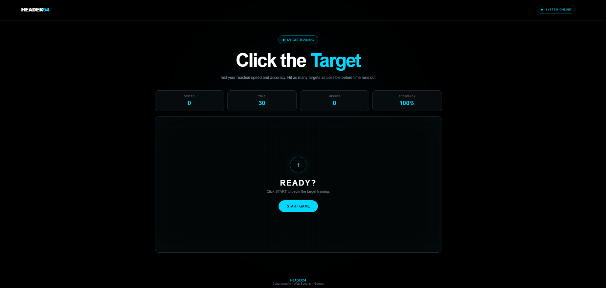

# 🎯 Click the Target — Header54

A fast-paced browser reaction game built with **HTML, CSS, and JavaScript**, designed with a clean **black + cyan cybersecurity HUD aesthetic** inspired by the Header54 portfolio theme.

Test your reaction speed, accuracy, and consistency by clicking randomly positioned targets before the timer runs out.

---

## 🖥️ Preview

> A minimal cyber-style interface featuring a neon cyan target, live game statistics, grid-based game area, and a dark Header54 visual identity.



---

## ✨ Features

- 🎯 Randomly positioned targets
- ⏱️ 30-second game session
- 🏆 Live score tracking
- ❌ Miss counter
- 🎯 Real-time accuracy calculation
- 📈 Progressive difficulty
- 📱 Responsive layout
- 🌐 Pure HTML, CSS & JavaScript
- 🖤 Black + cyan cyber-themed UI
- 💡 Neon glow and grid effects
- 🔄 Restart / Play Again functionality
- ⚡ No frameworks or external libraries required

---

## 🎮 How to Play

1. Open the game in your browser.
2. Click **START GAME**.
3. A target will appear inside the game area.
4. Click the target as quickly as possible.
5. Every successful hit increases your score.
6. Clicking outside the target counts as a miss.
7. Try to achieve the highest possible accuracy before the timer reaches `0`.

---

## 📊 Game Statistics

| Statistic | Description |
|---|---|
| **Score** | Number of targets successfully clicked |
| **Time** | Remaining game time |
| **Misses** | Number of clicks outside the target |
| **Accuracy** | Percentage of clicks that successfully hit the target |

### Accuracy Formula

```text
Accuracy = (Successful Hits / Total Clicks) × 100
```

---

## 🚀 Difficulty System

The target becomes smaller as your score increases.

```text
Score 0–9     → Normal Target
Score 10–19   → Smaller Target
Score 20–29   → Faster / Smaller Target
Score 30+     → Maximum Difficulty
```

This makes the game progressively harder as the player improves.

---

## 🛠️ Technologies Used

### HTML5

Used to create the structure of the game:

- Header
- Game statistics
- Game area
- Target
- Buttons
- Game-over screen

### CSS3

Used for the complete visual design:

- Dark theme
- Cyan neon effects
- Responsive layout
- Grid background
- HUD-style cards
- Hover effects
- Glow effects
- Mobile support

### JavaScript

Used for the game logic:

- Target positioning
- Score calculation
- Timer
- Miss detection
- Accuracy calculation
- Difficulty progression
- Game start/restart
- Game-over handling

---

## 📁 Project Structure

```text
click-the-target/
│
├── index.html
├── style.css
├── script.js
├── screenshot.png
└── README.md
```

---

## ▶️ Run Locally

### 1. Clone the repository

```bash
git clone https://github.com/YOUR-USERNAME/click-the-target.git
```

### 2. Open the project

```bash
cd click-the-target
```

### 3. Run the game

Simply open:

```text
index.html
```

in your browser.

You can also use **VS Code Live Server**.

---

## 🎨 Design

The interface follows the **Header54 cybersecurity portfolio theme**:

```text
Background      → #000000
Primary Cyan    → #00D9FF
Text            → #FFFFFF
Secondary Text  → Dark Blue/Grey
Borders         → Dark Cyan/Grey
```

The UI uses:

- Minimal typography
- Cyan accent color
- Subtle neon glow
- Dark grid
- Cybersecurity-inspired HUD elements

---

## 🧠 Learning Goals

This project is useful for practicing:

- DOM manipulation
- JavaScript event listeners
- `setInterval()`
- Random number generation
- Dynamic CSS positioning
- Game state management
- Conditional logic
- Responsive CSS
- HTML/CSS/JS project structure

---

## 🔮 Future Improvements

Possible future versions can include:

- 🔊 Sound effects
- 💥 Target hit animations
- 🔥 Combo multiplier
- 🥇 High-score system
- 💾 LocalStorage leaderboard
- 🎚️ Difficulty selection
- ⏱️ Multiple game modes
- 📱 Improved mobile controls
- 🧩 Moving targets
- 🧠 Reaction-time statistics
- 👤 Player profiles
- 🌐 Online leaderboard
- 🏅 Achievement system

---

## 📸 Screenshots


```text
screenshot.png
```

Then it will appear automatically in this README:


---

## 👨‍💻 Author

**HEADER54**

Cybersecurity • Web Security • Penetration Testing • Python

---

## 📜 License

This project is created for **learning, practice, and portfolio purposes**.

Feel free to study, modify, and improve the project.

---

<div align="center">

### ⚡ Built with HTML • CSS • JavaScript

**HEADER54**

</div>
